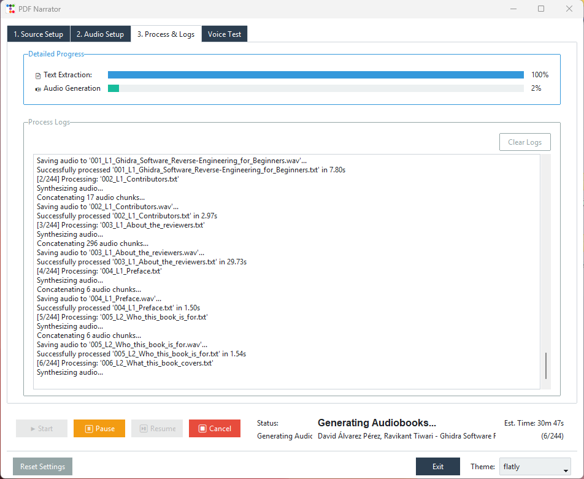

# PDF Narrator (Kokoro Edition)

Transform your PDF documents into audiobooks effortlessly using **advanced text extraction** and **Kokoro TTS** technology. This fork/variation of Kokoro allows for **longer file generation** and better handling of extracted PDF text.

## Demo

1. **Screenshot**  
   Check out the GUI in the screenshot below:  
   

2. **Audio Sample**  
   Listen to a short sample of the generated audiobook:  

https://github.com/user-attachments/assets/02953345-aceb-41f3-babf-1d1606c76641


## Features

- **Intelligent PDF Text Extraction**

  - Skips headers, footers, and page numbers.
  - Optionally splits based on Table of Contents (TOC) or extracts the entire document.

- **Kokoro TTS Integration**

  - Generate natural-sounding audiobooks with the [Kokoro-82M model](https://huggingface.co/hexgrad/Kokoro-82M).
  - Easily select or swap out different `.pt` voicepacks.

- **User-Friendly GUI**

  - Modern interface with **ttkbootstrap** (theme selector, scrolled logs, progress bars).
  - Pause/resume and cancel your audiobook generation anytime.

- **Configurable for Low-VRAM Systems**
  - Choose the chunk size for text to accommodate limited GPU resources.
  - Switch to CPU if no GPU is available.

---

## Prerequisites

- **Python 3.8+**
- **FFmpeg** (for audio-related tasks on some systems).
- **Torch** (PyTorch for the Kokoro TTS model).
- **Other Dependencies** listed in `requirements.txt`.

---

## Installation

1. **Clone the Repository**

   ```bash
   git clone https://github.com/mateogon/pdf-narrator.git
   cd pdf-narrator
   ```

2. **Create and Activate a Virtual Environment**

   ```bash
   python -m venv venv
   # On Linux/macOS:
   source venv/bin/activate
   # On Windows:
   venv\Scripts\activate
   ```

3. **Install Python Dependencies**

   ```bash
   pip install --upgrade pip
   pip install -r requirements.txt
   ```

4. **Download Kokoro Model**

   - Go to the [Kokoro-82M Hugging Face page](https://huggingface.co/hexgrad/Kokoro-82M).
   - Download the model checkpoint:  
     [kokoro-v0_19.pth?download=true](https://huggingface.co/hexgrad/Kokoro-82M/resolve/main/kokoro-v0_19.pth?download=true)
   - Place this file in the `models/` directory (or a subdirectory) of your project.  
     Example:
     ```bash
     mkdir -p models
     mv /path/to/kokoro-v0_19.pth models/
     ```

5. **Optional: Download Additional Voicepacks**

   - By default, `.pt` files (voicepacks) are in `Kokoro/voices/`.
   - If you have custom voicepacks, place them in `voices/your_custom_file.pt`.

6. **Install FFmpeg** (if you need transcoding/combining WAV files)

   - **Ubuntu/Debian**:
     ```bash
     sudo apt-get install ffmpeg
     ```
   - **macOS**:
     ```bash
     brew install ffmpeg
     ```
   - **Windows**: Download from the [FFmpeg official site](https://ffmpeg.org/download.html) and follow the installation instructions.

---

## Quick Start

1. **Launch the App**

   ```bash
   python main.py
   ```

2. **Select a PDF**

   - Browse to choose your PDF file.
   - Choose to extract by TOC-based chapters or by the entire book.

3. **Configure Kokoro TTS Settings**

   - Select the `.pth` model (e.g., `models/kokoro-v0_19.pth`).
   - Pick a `.pt` voicepack (e.g., `voices/af_sarah.pt`).
   - Adjust chunk size if you have limited VRAM.
   - Choose output audio format (`.wav` or `.mp3`).

4. **Generate Audiobook**

   - Click **Start Process**.
   - Track progress via logs, estimated time, and progress bars.
   - Pause/Resume or Cancel at any point.

5. **Enjoy Your Audiobook**

   - Open the output folder to find your generated `.wav` or `.mp3` files.

---

## Technical Highlights

### PDF Extraction

- Built atop [PyMuPDF](https://pymupdf.readthedocs.io/) for parsing text.
- Cleans up headers, footers, page numbers, and multi-hyphen lines.
- _Chapters vs. Whole:_
  - If TOC is found, you can split into smaller .txt files.
  - Otherwise, extract the entire text into one file.

### Kokoro TTS

- **Text Normalization & Phonemization**
  - Built-in text normalization for years, times, currency, etc.
- **Token-Based Splitting**
  - Splits text into < 510 tokens per chunk to accommodate model constraints.
  - Joins all chunked audio into a single final file.
- **Voicepacks (.pt)**
  - Each voicepack provides a reference embedding for a given voice.

### Low-VRAM/Speed Tips

- **Chunk Size**
  - If you run out of GPU memory, lower your chunk size from the default (2500) to something smaller (e.g., 1000 or 500).
- **Device Selection**
  - Choose `CUDA` if you have a compatible GPU, or `CPU` for CPU-only systems.

---

## Limitations

1. **PDF Layout**
   - Extraction can vary if the PDF has complex formatting or unusual text flow.
2. **TTS Quality**
   - The generated speech depends on the **Kokoro** model’s training and quality.
3. **Processing Time**
   - Long PDFs with complex text can take a while to extract and convert.

---

## Contributing

We welcome contributions!

- Fork, branch, and submit a pull request.
- Report bugs via [Issues](https://github.com/mateogon/pdf-narrator/issues).

---

## License

This project is released under the [MIT License](LICENSE.md).

Enjoy converting your PDFs into immersive audiobooks powered by **Kokoro** TTS!
